```
> thiagosdep@dev:~$ whoami
```

# Thiago Sousa

Software Engineer. Backend-focused, automation-driven.

<br>

## `stack --current`

```ts
const thiago = {
  languages: ["TypeScript", "JavaScript", "Python"],
  backend: ["NestJS", "Node.js", "Express"],
  frontend: ["React", "Next.js"],
  databases: ["PostgreSQL", "MongoDB", "Redis"],
  cloud: ["AWS", "GCP", "Serverless Framework"],
  devops: ["Docker", "GitHub Actions", "CI/CD"],
  testing: ["Jest", "Vitest"],
  ai_tools: ["Cursor", "Claude", "AI-assisted development"],
  principles: ["Clean Code", "SOLID", "DDD", "Event-Driven"],
};
```

<br>

## `workflow --tools`

**Cursor** as main IDE + **Claude** as coding partner. AI-augmented workflow for speed and quality.

<br>

## `cat philosophy.md`

```
- Readability over cleverness.
- If it can be automated, it should be.
- Architecture > frameworks. Frameworks change, good decisions stay.
- The best code is the code you don't have to write.
```

<br>

## `stats --github`

<p align="center">
  
</p>

<picture>
  <source media="(prefers-color-scheme: dark)" srcset="https://raw.githubusercontent.com/Thiagosdep/Thiagosdep/output/github-snake-dark.svg" />
  <source media="(prefers-color-scheme: light)" srcset="https://raw.githubusercontent.com/Thiagosdep/Thiagosdep/output/github-snake.svg" />
</picture>

<br>

## `ls tools/`

<div align="center">


</div>

<br>

## `echo $CONTACT`

```
thiago_sousap@hotmail.com
```

<div align="center">

[](mailto:thiago_sousap@hotmail.com)
[](https://github.com/Thiagosdep)

</div>

```
> thiagosdep@dev:~$ exit
```

---

<p align="center"><i>"The best code is the code you don't have to write."</i></p>
